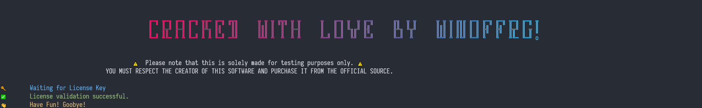

# Mingo Crack - PRO Activator

## Why do I prefer Mingo over MongoDB Compass?
As a Full Stack developer, I often work with MongoDB Compass. But, I find it to be a bit of a hassle to work with. Since then, I started looking out for some other MongoDB GUI Client which is has a little more better feel and a bit more advanced features. 🤷‍♂️

Found myself [Mingo](https://mingo.io)! A really good MongoDB GUI Client with all the features that I was looking for and also with a great UI. ⭐

## ⚠️ NOTE:
This tool is solely made for testing purposes. **And you should respect the Creator's work by getting a license for yourself**. It is only meant to give you a trial of Paid version before you buy it. 🙂

# ⚙️Support:
- Version: 1.8.0
- OS: Windows

## 📑 Steps: 
1. Download the latest release from this [link](https://github.com/WINOFFRG/mingo-crack/releases/) and extract the archive.
2. Press `Windows + R` and type `%USERPROFILE%\AppData\Local\Programs\mingo\resources`
3. Copy the `app.asar` from crack download directory and paste it in the above path.
4. Open Windows Terminal in crack directory and type `./patcher.exe`.
5. You must allow Windows Firewall to run the patcher.
6. Now run Mingo and goto `Mingo > License Key` and paste below into License Key:
```
cracked-by-winoffrg
```
7. Then press `OK` and your product will be automatically activated. Enjoy! 🎉




# ❓ Information
1. Patcher for MacOS/Linux will be avaliable soon.
2. If the license gets deactivated, just run the patcher again.
